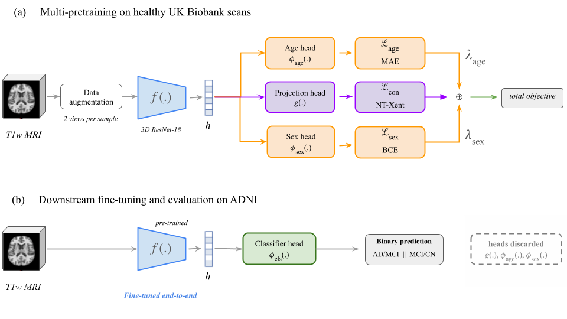

# Multi-Task Pre-Training Improves Alzheimer's Disease Classification from Structural MRI

Implementation for the multi-task pre-training approach we propose for Alzheimer's disease classification from structural MRI. The code is based on PyTorch and includes scripts for model pre-training, fine-tuning, and evaluation.



## Abstract
[TO BE COMPLETED]

## How to Prepare the Datasets

### For Pre-training
Prepare a CSV file with columns for the image paths, mask paths, age and sex of each scans. The column names should be provided in the pre-training script: `pretrain.py`. As an example, the CSV file can look like this:

```
image_path,mask_path,age,sex
/path/to/image1.nii.gz,/path/to/mask1.nii.gz,65,M
/path/to/image2.nii.gz,/path/to/mask2.nii.gz,70,F
```

### For Fine-tuning
In addition to the columns for image paths, mask paths, age and sex, you should also include a column for the diagnosis of each scan. Make sure to specify the name of the label column (e.g., `Group` or `label`) in the fine-tuning script: `alz_classification.py`. An example of the CSV file can be:

```
image_path,mask_path,Age,Sex,Group
/path/to/image1.nii.gz,/path/to/mask1.nii.gz,65,M,AD
/path/to/image2.nii.gz,/path/to/mask2.nii.gz,70,F,CN
```

## How to Run the Code
Please adjust the parameters in the script according to your dataset.

### Pre-training

Here is an example command for pre-training the model using two GPUs:

```
torchrun --nproc_per_node=2 pretrain.py \
    --data_file /path/to/pretraining_data.csv \
    --save_model_path /path/to/save_directory \
    --epochs 500 \
    --batch_size 120 \
    --image_col image_path \
    --mask_col mask_path \
    --age_col age \
    --sex_col sex \
```

### Fine-tuning
If you want to fine-tune the pre-trained model, you should specify the path to the pre-trained checkpoint (`--simclr_ckpt`). If you just want to train the model from scratch, you can omit this argument. Here is an example command for fine-tuning the model:

```
python3 alz_classification.py \
    --categories MCI_CN \
    --train_file /path/to/train.csv \
    --val_file /path/to/val.csv \
    --test_file /path/to/test.csv \
    --simclr_ckpt /path/to/pretrained_checkpoint.tar \
    --save_path /path/to/save_directory \
    --lp_or_ft ft \
    --image_col image_path \
    --mask_col mask_path \
    --age_col Age \
    --sex_col Sex \
    --label_col Group \
    --batch_size 32 \
    --epochs 100 \
```
For running our early-fusion model, you can enable the `--age_sex_channel_aware` flag in the command above. Same goes for the late-fusion model with the `--age_sex_encoder_aware` flag. In either case, you should not specify `--simclr_ckpt` since the early-fusion and late-fusion models are trained from scratch.

## Environment Setup
Here are the packages we used in our experiments.
* python 3.11
* numpy 1.26.4
* torch 2.3.0
* pandas 3.0.5
* nibabel 5.4.2
* monai 1.3.0
* scikit-learn 1.3.2
* scipy 1.17.1
* cudnn 8.9.2.26
* cudatoolkit 12.1.105

GPU: NVIDIA H100.

You can install the packages using pip from the `requirements.txt` file:

```
pip install -r requirements.txt
```

## Acknowledgements
We built our code based on the following repositories. We would like to thank the authors for their contributions.
* [Medical Open Network for AI - MONAI](https://github.com/project-monai/monai)
* [PyTorch implementation of SimCLR](https://github.com/Spijkervet/SimCLR)
* [3D Brain MRI Foundation Model](https://github.com/emilykaczmarek/3D-Neuro-SimCLR). 

## Questions?
Open an issue in this repository or send us an [email](mailto:kaleb.asfaw@ucalgary.ca).